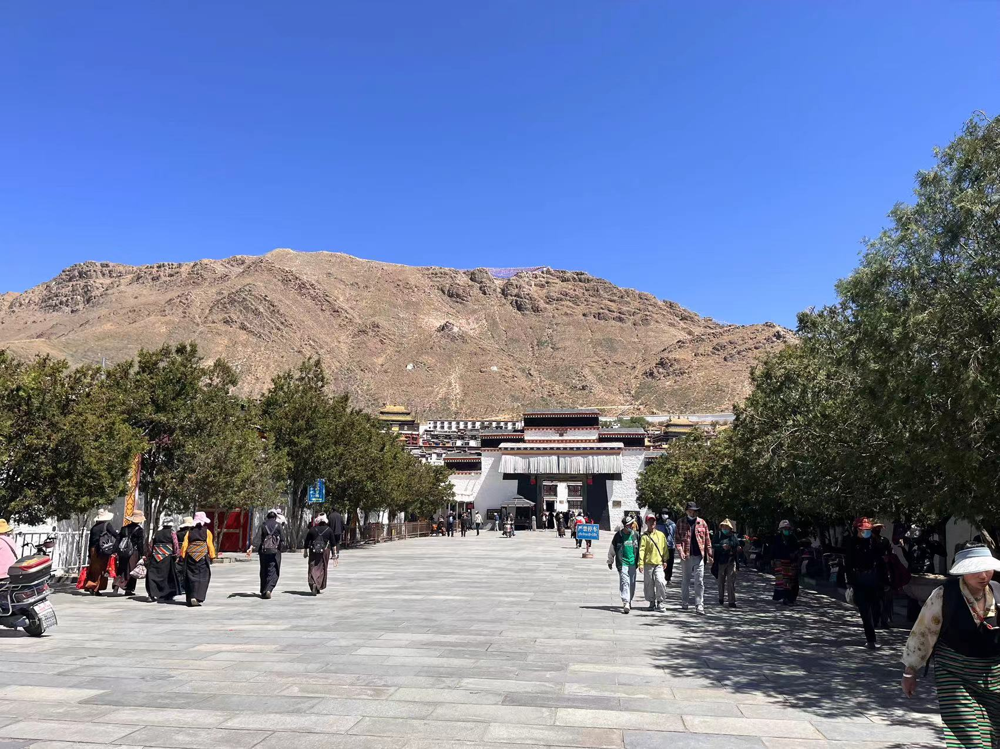
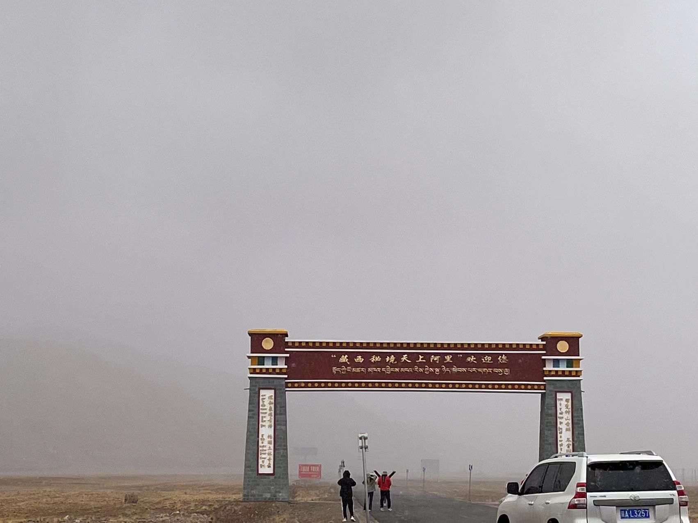
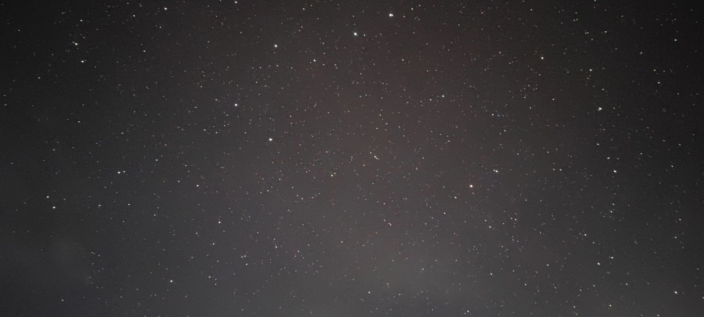

# 云上阿里自驾

回国几个月以来一直想自驾去西藏看看。接近6月份时总算有了机会。我们在川藏线318和新藏线219之间纠结了些许。最终选择了更有挑战的新藏线219。其实这是我在国内的第一次自驾，之前只开过las Vegas，羚羊谷，厄瓜多尔之类的，对于国内的路况也不是很熟悉。所以这还是蛮大的一次挑战。

## 行前准备

### 药物准备
因为新藏线的平均海拔在4500以上，对抗高反是最重要的事情。首先红景天，高原安这类的保健品是几乎没有用的。乙酰挫安是唯一有效的高反药，因为是处方药不好买，所以建议在京东大药房上面买。乙酰挫安是处方药，所以多少会有一些副作用。为此我们需要准备氯化钾和碳酸氢钠。乙酰挫安会导致身体缺钾，手脚发麻，利尿，所以需要氯化钾来对抗。但氯化钾会导致肚子不舒服腹泻，所以需要碳酸氢钠来中和。其次需要准备一些感冒药，治疗拉肚子的药，还有晕车药。怕晚上睡不着的话还可以备一点褪黑素。

### 生活用品准备
首先防晒是必须的，高原的太阳真的很大。建议准备防晒衣，墨镜和防晒霜。其次高原真的很干，建议准备唇膏，鼻腔喷剂，金红霉素眼膏（晚上摸鼻子里面有些许效果），还可以准备一个车载加湿器。本来我们还准备了户外电源，现在看来用处不大，连三十里营房都通电了，珠峰大本营可能没电，要去的话可以备一个，直接京东下单寄到酒店就好。一路上酒店基本上都有洗漱用品，如果打算住好一点的酒店的话是不需要带洗漱用品的，最多带点洗面奶。保温杯或者大保温壶可以带上，路上喝点热水泡点奶茶啥的。

### 衣物准备
带的越多越好，六月初冷的时候会到零下4度。羽绒服，抓绒，冲锋衣，秋裤都必须带上。冲锋衣真的需要带，阿里的风特别大，6️都还会下大雪。

### 吃饭注意
尽量吃炒菜，不要吃需要煮的东西，如果要吃需要煮的东西一定要问问是不是高压锅煮的，高原上水温不够肉根本煮不熟。我们在布达拉宫边上吃了个云吞拉了好几天肚子。

### 拍照准备
三脚架一定要带一个，用来拍日照金山和星空。相机因为我们不会用就没带。无人机最好也能带一个，最好买好一点的，不然风大了根本没法飞。我用的是dji mini3，只敢在没风的时候飞一飞。

### 租车准备
我们选的是神州租车拉萨贡嘎机场取车，喀什机场还车，全保险，一共12天花了9600多，其中异地还车费就占了5000多的样子。芝麻信用分够可以抵用押金。我们租的是大众揽境 四驱 6座 2.0T。说实话车不太好，土路基本上开不下去，最好还是能搞个越野车，就是油费多花点。

### 其他准备
边防证一定要办好，最好能把新疆西藏所有地区都给写上，每个地区办理边防证的流程不一样，所以也不好详细介绍。驾驶证和身份证也一定要记得带上。插线板也可以带上，因为要充电的东西比较多。最后就是记得把离线地图下载好就好了。

## 第一天
下午到达的拉萨贡嘎机场，我们在贡嘎买了点氧气，超市里买了点物资，就直接前往拉萨香格里拉酒店入住了。贡嘎机场到拉萨香格里拉酒店基本上就是1h，全程高速。吃了乙酰挫安之后一点反应都没有，嘎嘎猛。

### 第二天
第二天我们就在拉萨市区里面玩玩。布达拉宫要进去的话需要提前七天在小程序上预约。布达拉宫黄牛票超过1k。大昭寺需要提前一天预约。血泪教训就是在拉萨不要开车出去玩，没有任何停到车的可能，去布达拉和八廓街最好是打车。药王山观景台据说是一个拍布达拉的好地方。香格里拉酒店对面是西藏博物馆，人也是超级多，根本不想去挤。

晚上随便去吃了一个藏餐，只能说还行吧，没有特别惊艳。

### 第三天
第三天就直接自驾出发啦。今天的线路是拉萨到羊卓雍措(羊湖)，到卡若拉冰川到江孜。因为我们不想走大众线路，所以去羊湖的时候走的是羊湖南端，看鲁日拉观景台（海拔超过5000），日托寺，经过工布学乡。盘山路其实还是蛮难开的。走羊湖北端据说要被拦下来收门票。我们在卡若拉冰川停下来拍照的时候居然都有人来收门票，我们直接当场开走，不想鸟他。

这是去往羊湖下面的一段路

鲁日拉观景台上拍出来的羊湖，太美了

这是日托寺，xhs上看见的比较网红的一个景点，号称是一僧一湖一寺庙。看了一下感觉也就还行。开过来要走20分钟搓衣板路。

这是卡若拉冰川，因为是下午了，光线不是很好，拍出来感觉一般。还有就是这个是可以登上去看的，不过我们就没有去了。

顺便避雷一下江孜江沅酒店，晚上12点就停电，早上9点了都还不来电，以后西藏定酒店一定要问晚上会不会停电。万幸他家酒店的韭黄肉丝味道还不错。

### 第四天
今天从江孜出发，经过日喀则的扎什伦布寺，加错拉山观景台，加措乡珠峰观景台，到定日金廷酒店入住。日喀则扎什伦布寺一定要去看，一定要请一个导游，太值得一去了。第一任dalai和多任班禅大师都葬在这个寺庙。现任班禅大师也在扎什伦布寺组织工作。寺庙里都是僧侣和朝圣者，没有一点商业气息。不过就是要注意这个寺庙的开放时间，淡季和旺季好像不一样。

这是今天路的片段

加错拉山观景台上面有一些藏民在买纪念品。我们买了串牛角珠和羊角，我估计能砍到50两串。

这是在珠峰观景台拍到的日落金山，下面是视频链接。我们就没去大本营了，要在上面住一晚还是挺烦的。珠峰观景台在8点-8点半之间到达的话可以看日照金山，非常漂亮。

金廷酒店其实是叫云上四季，是这段时间住过的最好的酒店，强烈推荐。

### 第五天
今天行程比较轻松，在定日休息到中午12点才出发，途径佩估措希峰观景台，到达萨嘎。其实这天住仲巴也是可以的，只是仲巴海拔好像有点太高了，我们没敢去住。其实今天行程有点小瑕疵，因为佩估措是在东岸，下午太阳已经西下，有点小逆光。

去佩估措那天天气真的很好，太美了。

顺道一提，萨嘎这家餐厅的羊肉汤真的绝了，老板是内江资中人。羊肉极其鲜美，他家早餐的包子也是肉多油足。

### 第六天
今天的行程极其挑战，我们准备直接从萨嘎杀到普兰县城，其实还有一个选项是住塔尔钦，但塔尔钦海拔实在太高（接近4700），JC在萨嘎已经高反严重，所以我们准备杀到海拔只有3700的普兰镇。普兰镇是在中印尼三国边境的交界处，颇有异域风情。今天路上会经过神山冈仁波齐，圣湖玛旁雍措和鬼湖拉昂错。吉吾寺是一个看冈仁波齐和玛旁雍措的好景点。

今天便是正式进入阿里的一天

快到阿里就已经下起了大雪

可惜这两天天气不好，冈仁波齐未能露出真容（后面有反转）

这是三大圣湖之一的玛旁雍措

这是鬼湖拉昂错，风真的超级大，这两个湖之间我感觉相隔不超过2km

这是普兰边贸市场，比起xhs上看的2020年的边贸市场少了太多的烟火气。里面的东西贵得惊人，真的不推荐了。不过里面至少大部分都是真的尼泊尔人。

晚上在里面找了一家尼泊尔人吃的餐厅，中文都不太会说，让老板随便弄的菜。这个价格还算公道。羊肉和土豆巨好吃。可以排得上我心目中第二好吃的羊肉（仅次于cotopaxi上的烤羊）

## 第七天
今天按照原计划本来应该是从普兰前往札达，看札达土林，古格王朝，但是因为一些个人原因，我们不得不提前离开西藏，从普兰直接开到狮泉河镇，第八天从阿里机场飞到拉萨，再返回成都。

今天刚从普兰出来就发现四处都被大雪覆盖了，一夜之间仿佛就变了一个地方

晚上去了阿里暗夜公园看星星，11点到达效果是比较好的，狮泉河开过去大概20-30分钟。我用的小米手机拍的，ISO拉到3200，聚焦弄到最远，曝光时间搞个30秒。但说实话感觉一般，可能是天气的原因，感觉不如 las vegas

## 第八天
第八天从阿里飞回拉萨飞回成都，车本来应该还回喀什，我们只能找了个代驾帮我们开回拉萨。阿里的机票钱真的超级贵，代驾也很贵。可以说是大出血了。幸运的是在飞机上看了到冈仁波齐，满足了。

## 虚拟的第八天
从札达开到多玛乡

## 虚拟的第九天
从多玛乡到三十里营房

## 虚拟的第十天
从三十里营房到叶城

## 虚拟的第十一天
从叶城到喀什

# 总结
西藏雪山湖泊真的让人流连忘返，最终没有开到喀什或许略有遗憾，但也是下一次再来的理由。这是我第一次进藏，但肯定不会是最后一次。下次或许是青藏线，或许是充满宗教风情的317色达，或者是冈仁波齐的转山，或者是再来札达土林，穿越三十里营房。期待着下一次与西藏的重逢。

作者：刘旭辉

2023-06-07

拉萨贡嘎机场

